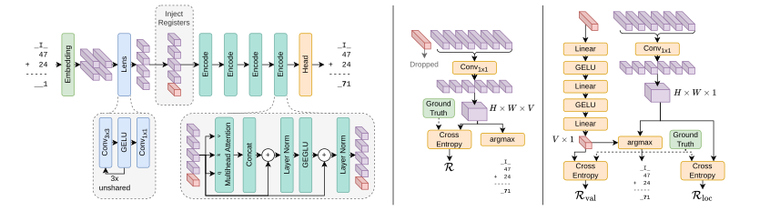

<h1 align="center">Lens Transformer<br><sub><sup>Length Generalization in Transformers for Algorithmic Addition</sup></sub></h1>

<div align="center">

[](https://huggingface.co/spaces/gserifi/lens-transformer)&#160;
<a href="https://polybox.ethz.ch/index.php/s/BbjxDRyDpdMQJA7" target="_blank"></a>
</div>

<div align="center">
Cyril Moser
&nbsp;&nbsp;&nbsp;&nbsp;
Gent Serifi
&nbsp;&nbsp;&nbsp;&nbsp;
Nicola Studer
&nbsp;&nbsp;&nbsp;&nbsp;
Aaron Zeller
&nbsp;&nbsp;&nbsp;&nbsp;

ETH Zurich, Switzerland
</div>



## Get Started

This section outlines how to setup the local environment to execute training, evaluation, and plotting scripts.
To see the model in action, you can also try out the [Demo](https://huggingface.co/spaces/gserifi/lens-transformer) without any setup.

### Create Virtual Environment

```bash
python3 -m venv venv
source venv/bin/activate
pip install -U pip # Good practice to update pip
```

### Install PyTorch and PyTorch Lightning

```bash
# Tested on Apple Silicon and CUDA 12.8
# For other versions see https://pytorch.org/get-started/locally/
pip install torch torchvision lightning
```

### Install Remaining Dependencies

```bash
pip install -e .
```

### Setup Pre-Commit hooks (Development only)

```bash
pre-commit install
```

This will run `black` code formatting to ensure consistency. Note that if the check fails, the commit will be rejected. You can also run `black .` prior to committing to bring the code into the right shape.

## Train

```bash
python3 train.py -cn <path_to_config>
# Example: python3 train.py -cn model_full
# Predefined configs can be found in the configs/ folder, remember to omit the .yaml suffix.
```

Alternatively, a pretrained checkpoint can be downloaded from [Polybox](https://polybox.ethz.ch/index.php/s/BbjxDRyDpdMQJA7) and used for evaluation or plotting.
Create an `outputs` folder at the root directory and extract `model_full.zip` to match the following layout:

```
outputs
└── model_full
    ├── .hydra
    │   ├── config.yaml
    │   ├── hydra.yaml
    │   └── overrides.yaml
    └── checkpoints
        └── ckpt_best.pth
```

Note that when training from scratch, these files will be organized in subfolders indicating the date and time of the current run `outputs/<model_name>/yyyy-mm-dd/hh-mm-ss/...`.

## TensorBoard

Training progress can be monitored using TensorBoard:

```bash
tensorboard --logdir outputs/
```

## Evaluation

```bash
python3 eval.py eval_config.yaml
```

Parameters can be overwritten using CLI args found with `python eval.py --help`.

This script will write its outputs to the console, as a LaTeX table to `evaluation_results.txt`, and as per-digit CSV files `eval_results_digit_<d>.csv` by default.
Note that for large sample counts, this may take some time to complete..

## Plotting

```
python3 plotting/plotter.py \
--model_dir outputs/model_full \
  --ckpt ckpt_best.pth \
  --activation_layers \
      _forward_module.lens.0 \
      _forward_module.lens.3 \
      _forward_module.lens.5 \
      _forward_module.lens.7 \
      _forward_module.lens.8 \
  --semantic_kernel_layer _forward_module.lens.0 \
  --sensitivity \
  --attention-sensitivity \
  --mask \
  --n_digits 5
```

The full reference of arguments can be acquired via `python plotting/plotter.py --help`.

This script will write its outputs to `<model_dir>/plots/`. The warning message `findfont: Font family 'Times New Roman' not found.` can be ignored.

## References

```bibtex
@article{vaswani2017attention,
  title={Attention is all you need},
  author={Vaswani, Ashish and Shazeer, Noam and Parmar, Niki and Uszkoreit, Jakob and Jones, Llion and Gomez, Aidan N and Kaiser, {\L}ukasz and Polosukhin, Illia},
  journal={Advances in neural information processing systems},
  volume={30},
  year={2017}
}
```

```bibtex
@article{shazeer2020glu,
  title={Glu variants improve transformer},
  author={Shazeer, Noam},
  journal={arXiv preprint arXiv:2002.05202},
  year={2020}
}
```

```bibtex
@article{su2024roformer,
  title={Roformer: Enhanced transformer with rotary position embedding},
  author={Su, Jianlin and Ahmed, Murtadha and Lu, Yu and Pan, Shengfeng and Bo, Wen and Liu, Yunfeng},
  journal={Neurocomputing},
  volume={568},
  pages={127063},
  year={2024},
  publisher={Elsevier}
}
```
